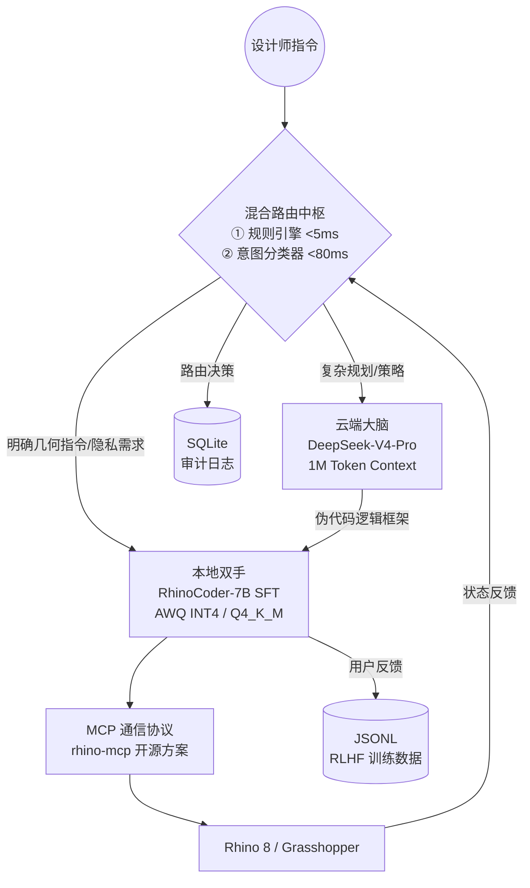

# 产品需求文档 (PRD): RhinoCoder Hybrid

**版本:** 2.0  
**状态:** 架构确认版  
**负责人:** 罗雄伟 (ETH Zurich, Integrated Building Systems)  
**最后更新:** 2026-04  
**变更摘要 (v1.0 → v2.0):** 云端大脑确定为 DeepSeek-V4-Pro；本地模型明确为 Qwen2.5-Coder-7B SFT；补充 MVP 技术栈选型；新增 16GB 统一内存部署形态；扩充成功指标（含 API 成本）；细化 Roadmap 至具体交付物

---

## 1. 产品愿景 (Vision)

为专业建筑师与工业设计师打造一个**极低延迟、数据隐私合规、零 API 幻觉**的 AI 辅助建模系统。通过"云端大脑（规划）+ 本地双手（执行）"的混合架构，将大模型的推理能力与本地微调模型的精准控制完美结合。

**核心设计原则：**

| 原则 | 说明 |
|---|---|
| **数据重力** | 敏感几何数据永远不离开本地网络边界 |
| **厂商无关** | 云端模型通过统一适配器接入，支持运行时切换 |
| **渐进增强** | 断网环境下降级为纯本地模式，核心建模能力不中断 |
| **可审计路由** | 每条指令的路由决策均记录原因，支持合规审查 |

---

## 2. 目标用户与痛点 (Target Audience & Pain Points)

### 2.1 目标用户

* 建筑事务所 (Architectural Firms)
* 工业设计公司 (Industrial Design Studios)
* 参数化设计专家 (Computational Designers)

### 2.2 核心痛点

1. **隐私安全**：企业核心设计图纸与坐标数据严禁上传至公有云。
2. **交互延迟**：完全依赖云端 API 导致 3D 建模中的微调动作反馈缓慢（3–10 秒）。
3. **技术门槛**：Rhino/Grasshopper API 学习曲线陡峭，大模型常产生代码幻觉。

---

## 3. 功能列表 (Feature List)

### 3.1 混合智能路由 (Hybrid AI Router)

* **两阶段判断**：规则引擎（<5ms）快速通道优先，轻量意图分类器（<80ms）兜底处理模糊指令。
* **任务分发**：将"概念方案设计"路由至云端大脑；将"具体几何操作"路由至本地模型。
* **隐私过滤**：识别含项目敏感坐标或专有图层名的指令，强制执行本地推理，双重脱敏校验兜底。
* **可审计日志**：每条指令记录完整路由溯源（规则结果、分类器置信度、最终路由、隐私标记），写入本地 SQLite，支持合规查询。

### 3.2 云端规划大脑 (DeepSeek-V4-Pro)

* **超长上下文规划**：1,000,000 token 上下文窗口，支持将全量项目设计规范、历史 Grasshopper 脚本、Rhino API 文档同时注入，实现跨阶段设计一致性保障。
* **批量方案评估**：在单次请求内对多个形态变体进行全局一致性对比，避免多次独立请求的基准漂移。
* **厂商无关接入**：通过统一 `CloudLLMProvider` 适配器接入，支持运行时切换至 Claude / GPT-4o / Azure OpenAI（适配企业合规偏好）。
* **职责边界**：云端模型**仅输出**步骤化伪代码逻辑框架，不直接生成可执行 Rhino API 代码，最终代码统一由本地模型填充以规避幻觉。

### 3.3 本地执行模型 (RhinoCoder-7B)

* **基座模型**：Qwen2.5-Coder-7B-Instruct（HumanEval 88.4%，中文指令原生支持，Apache 2.0 协议）。
* **垂直微调**：基于 ~43,000 条 Rhino 专用数据集（官方文档蒸馏 + 内部脱敏脚本 + 大模型合成增强）进行 LoRA SFT，深度优化 `rhinoscriptsyntax` 与 `RhinoCommon` API 调用准确率。
* **本地推断**：RTX 4090 部署 AWQ INT4 量化，短指令代码生成延迟 150–350ms；Apple Silicon 16GB 统一内存部署 Q4_K_M 量化（llama.cpp / MLX），延迟 400–800ms。
* **断网可用**：无互联网环境下完成 ≥ 70% 建模任务覆盖。
* **自愈执行**：代码执行报错时，本地模型自动 Debug 重试（最多 2 次），成功样本回流为 RLHF 正样本。

### 3.4 增强型 MCP 空间交互通道

* **双向同步**：实时获取 Rhino 视窗状态（图层、几何体属性、坐标系），MCP Server 优先复用开源 `rhino-mcp` 方案，Q4 视稳定性评估是否升级为自研 .NET Plugin。
* **工具集**：`get_rhino_context` / `execute_python_script` / `get_object_properties` / `undo_last_operation`。

### 3.5 交互界面

* **MVP 形态**：localhost 轻量 HTML Panel，通过 Rhino 内嵌 WebView 挂载，Agent 侧以 `aiohttp` 提供静态服务与 WebSocket 实时通信，无需重新编译 .NET 插件即可迭代 UI。
* **Q4 升级目标**：C# Eto.Forms 原生面板，获得完整的 Rhino 原生控件体验。

---

## 4. 系统架构 (System Architecture)

**本地进程拓扑：**

| 进程 | 技术实现 | 说明 |
|---|---|---|
| `rhinocoder-agent` | Python `asyncio` + `mcp` SDK + `Typer` | 主控进程，托管路由中枢与 MCP 客户端 |
| `rhinocoder-inference` | vLLM (RTX 4090) / llama.cpp (Apple Silicon) | 本地模型推理服务，暴露 OpenAI-compatible API |
| `rhino-mcp-server` | rhino-mcp 开源方案（Python） | 嵌入 Rhino 的 MCP Server 插件 |
| `rhinocoder-ui` | aiohttp 静态服务 + WebSocket | 对接 Rhino 内嵌 WebView 面板 |

---

## 5. MVP 技术栈 (Tech Stack)

| 模块 | 选型 | 关键理由 |
|---|---|---|
| Agent 主控 | `asyncio` + `mcp` SDK + `Typer` | 原生异步，无 web 框架开销，跨平台兼容 |
| 交互界面 | localhost HTML + Rhino WebView | 迭代无需重编译插件，Q4 升级为 Eto.Forms |
| 数据蒸馏 | `httpx` + `asyncio` + 大模型 API | 基于官方文档蒸馏合成 SFT 样本，无需论坛爬虫 |
| 路由日志 | SQLite（标准库） | 支持多维合规查询 |
| RLHF 数据 | JSONL | 直接兼容 HuggingFace `datasets` |
| Pass@1 评估 | `pytest` + Mock + `rhino3dm` + Rhino.Compute（三层递进） | 按成本递增，L1+L2 跑 CI，L3 每周回归 |

---

## 6. 核心使用路径 (Core User Journey)

1. **需求输入**：设计师在 RhinoCoder 面板输入："基于这组曲线生成一个起伏的参数化表皮，并确保所有交点符合生产精度"。
2. **智能路由**：
   * 系统识别"参数化表皮生成"涉及复杂逻辑 → 路由至 DeepSeek-V4-Pro，注入全量项目规范文档（最大 800K tokens），生成拓扑策略伪代码。
   * 系统识别"交点精度微调"为高频 API 操作 → 路由至 RhinoCoder-7B 本地模型。
3. **协同执行**：
   * 云端模型输出整体生成策略的逻辑框架（不含可执行代码）。
   * 本地模型接手具体 API 填充，在 500ms 内完成代码生成并通过 MCP 在 Rhino 中执行。
4. **实时交互**：设计师说"再弯一点"→ 规则引擎识别为增量微调指令 → 直接通过本地模型完成 <500ms 实时修正，无需调用云端。
5. **自愈与学习**：执行报错时本地模型自动 Debug 重试；设计师手动修改的代码自动记录为 RLHF 对齐样本，写入 `feedback.jsonl`。

---

## 7. 成功指标 (Success Metrics)

### 7.1 性能指标

| 指标 | 当前基线 | 目标值 |
|---|---|---|
| 基础建模指令平均响应延迟 | > 5s（纯云端） | < 800ms（RTX 4090）/ < 2000ms（16GB 统一内存） |
| 增量微调指令延迟（"再弯一点"类） | 3–10s | < 500ms |

### 7.2 质量指标

| 指标 | 当前基线 | 目标值 |
|---|---|---|
| Rhino API 代码 Pass@1 | ~40%（通用模型） | ≥ 85%（SFT 后） |
| 断网可用建模任务覆盖率 | 0% | ≥ 70% |

### 7.3 安全指标

| 指标 | 目标值 |
|---|---|
| 几何坐标数据云端泄露率 | 0%（路由规则 + 双重脱敏双保险） |
| 含 `privacy_flag=1` 的指令被路由至云端的记录数 | 0 条（每日合规查询自动验证） |

### 7.4 成本指标

| 指标 | v1.0 基线（Claude / GPT-4o） | v2.0 目标（DeepSeek-V4-Pro） |
|---|---|---|
| 月度 API 成本（10 人团队） | ~$792 / 月 | ~$69 / 月（↓ 91%） |
| 年度 API 成本 | ~$9,500 / 年 | ~$825 / 年 |

> **节约再投资：** 91% 的 API 成本削减释放约 $8,700/年，优先用于 DeepSeek-V4-Pro 自身合成更多 SFT 训练数据（预计增加 ~30,000 条），形成正向飞轮。

---

## 8. 后续规划 (Roadmap)

### Q2：数据与模型基础

* 基于 rhinoscriptsyntax / RhinoCommon 官方库源码与 API 文档，通过异步调用大模型 API（DeepSeek-V3 / Claude 3.5）进行数据蒸馏，直接合成含自然语言指令与正确代码的高质量 JSONL 训练集，目标交付 ~43,000 条 SFT 样本（官方文档蒸馏 ~20,000 条 + 合成增强 ~20,000 条 + 内部脚本 ~3,000 条）
* 基于 Qwen2.5-Coder-7B 完成 LoRA SFT 微调，在 RTX 4090 AWQ INT4 环境下完成 Pass@1 基准测试
* 建立三层 Pass@1 评估框架（Mock 层 + `rhino3dm` 层 + Rhino.Compute 层），目标 L2 Pass@1 ≥ 85%
* 评估 DeepSeek-V4-Pro API 的企业合规数据驻留政策（对应风险 R6）

### Q3：系统集成与原型验证

* 实现基于 `mcp` SDK 的混合路由中枢原型，完成规则引擎 + 意图分类器两阶段集成
* 复用 `rhino-mcp` 开源方案完成 MCP Server 插件部署，验证稳定性（对应风险 R1）
* 完成 localhost HTML WebView 交互界面，与 Agent WebSocket 通道联调
* 在 Rhino 8（Windows / macOS）内完成端到端冒烟测试，验证 <800ms 延迟目标
* 16GB 统一内存（Apple M3 Pro）环境压测，验证 OOM 自适应降级机制（对应风险 R7）
* 路由规则误判红队测试，验证敏感数据零泄露（对应风险 R4）
* 与法务确认 RLHF 反馈数据收集的用户授权协议（对应风险 R5）

### Q4：闭环迭代与生产化

* 上线用户反馈闭环（JSONL 采集 → 匿名化 → 增量微调），利用设计师手动修改数据持续迭代本地模型
* A/B 测试验证 RLHF 后 Pass@1 提升幅度
* 评估 MCP Server 是否升级为自研 .NET Plugin（方案 B），视 Q3 稳定性结论决定
* 交互界面升级为 C# Eto.Forms 原生面板
* 多用户并发（>4 人）场景压测，视结果决定多卡/多实例扩展方案（对应风险 R3）

---

## 9. 主要风险登记 (Risk Register)

| # | 风险描述 | 等级 | 计划解决时间 |
|---|---|---|---|
| R1 | rhino-mcp 开源方案生产稳定性未验证 | 🟡 中 | Q3 原型期评估，必要时切自研 .NET Plugin |
| R2 | Qwen2.5-Coder-7B 量化后 Pass@1 实测值未知 | 🟡 中 | Q2 微调完成后基准测试 |
| R3 | 多用户并发 >4 人时 RTX 4090 单卡成为瓶颈 | 🟠 高 | Q4 压测，多卡/多实例方案备案 |
| R4 | 路由规则误判导致敏感数据意外路由至云端 | 🔴 严重 | 双重脱敏校验 + Q3 红队测试 |
| R5 | 设计师反馈数据收集的合规授权流程 | 🟡 中 | Q3 与法务确认数据使用协议 |
| R6 | DeepSeek-V4-Pro 企业合规环境数据驻留政策待核实 | 🟠 高 | Q2 评估企业版/私有化部署选项 |
| R7 | 16GB 统一内存下 Rhino + 推理服务内存竞争导致 OOM | 🟡 中 | Q3 压测，实现内存压力自适应降级 |
| R8 | 超长上下文（>500K tokens）场景 DeepSeek API 响应超时 | 🟡 中 | Q3 实测，调整 Prompt Cache 预热策略 |

---

## 10. 关联文档 (Related Documents)

| 文档 | 版本 | 说明 |
|---|---|---|
| `design-document.md` | v0.2 | 系统技术设计文档，含详细架构、接口定义、量化部署规范 |
| `tech-stack.md` | v1.0 | MVP 阶段技术栈选型，含完整代码示例与升级路径 |
