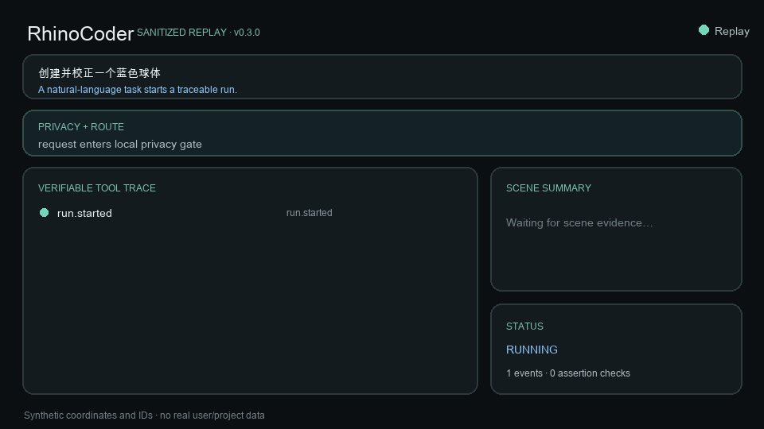
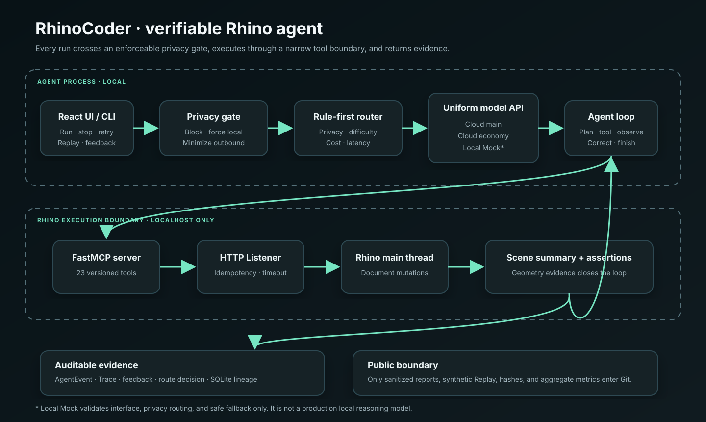
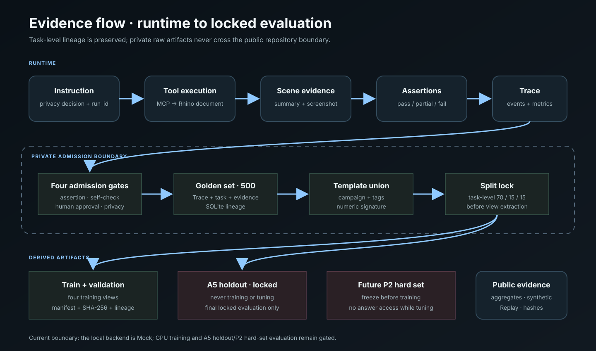

# RhinoCoder

> **让 AI 不只“写 Rhino 脚本”，而是执行、观察、验证并在失败后恢复。**

[English](README.en.md) · [无 Rhino 的 5 分钟 Replay](#quickstart-a无需-rhino) · [真实 Rhino Quickstart](#quickstart-b真实-rhino-8) · [证据索引](docs/portfolio-evidence.md) · [架构](docs/architecture.md)

RhinoCoder 是一个面向 Rhino 8 的可验证空间设计 Agent。它把自然语言任务转成 23 个版本化 MCP 工具调用，在 Rhino 主线程执行几何操作，再通过 `get_scene_summary` 和程序化断言读取并核对真实场景。每次运行的隐私判断、模型路由、工具调用、纠错、成本和证据都由同一 `run_id` 关联，可停止、重试、Undo、精准回滚，也可在没有 Rhino 和模型密钥时重放脱敏合成 Replay。

**English in one paragraph.** RhinoCoder is a verifiable, recoverable, privacy-aware spatial agent for Rhino 8. It executes natural-language tasks through 23 versioned MCP tools, reads the resulting scene back, checks geometry with programmatic assertions, and links privacy, routing, tools, corrections, cost, and evidence under one auditable `run_id`. Reviewers without Rhino can run sanitized synthetic Replay locally; see the [English README](README.en.md).



## 30 秒看懂结果

| 已验证结果 | 口径与证据 |
|---|---|
| **500/500 黄金 Trace，46 个标签** | 断言、场景自检、人工确认、脱敏四道准入；[A7 报告](docs/a7-500-marginal-value.md) |
| **8/8 覆盖缺口达到计划量** | A7 新增 200 条：布尔替代恢复与多轮修订各 40，其余 6 类各 20；[A7 报告](docs/a7-500-marginal-value.md) |
| **270/270 固定真实 Rhino 运行通过** | 30 题 × 3 次 × 主模型/低成本模型/规则路由；该固定集已饱和，不能外推为开放世界效果；[A6 报告](docs/a6-no-finetune-baseline.md) |
| **隐私审计 0 敏感发现** | 12 条红队、1,609 条 Trace、7,016 行 SQLite、3 份 Replay 及模拟日志/请求面；[A4 报告](docs/privacy-red-team-report.md) |
| **A1–A7、B1–B4 已验收** | 数据、审计、路由、隐私、训练管线和 CPU 冒烟完成；GPU 正式训练未执行；[路线图](PROJECT_OPTIMIZATION_PLAN.md) |

当前正式版本：[`v0.3.0`](https://github.com/xiongweiluo/RhinoCoder/releases/tag/v0.3.0)。版本、文档、Replay、GIF、发布脚本和验证证据已随 Git Tag 与 GitHub Release 发布；真实 Rhino 视频按项目所有者决定延期，不影响 Replay 与证据复核。

> **诚实边界：** `local-mock` 只是确定性的本地接口与安全替身，证明统一后端、隐私强制路由和禁止云端降级；它不是能完成 Rhino 建模的真实本地模型。当前没有学校 GPU 验收或 LoRA 效果结论，A5 holdout 也未用于训练或调参。

## 为什么这个项目不是普通 “LLM + 工具” Demo

- **完成必须有几何证据**：模型说“完成”不算完成；系统重新读取 Rhino 场景，并核对数量、尺寸、颜色和空间关系。
- **隐私门先于模型和 MCP**：Critical 请求提前阻断，High 强制本地且禁止云 fallback，Medium 先最小化再出站；关闭普通路由也不能绕过。
- **恢复不会重复造物体**：变更工具携带幂等键，模型降级发生在规划边界，不重放已完成工具；支持取消、重试、Undo 与任务级精准回滚。
- **指标能回到一次运行**：统一事件信封、Trace 与 SQLite 血缘让路由、工具、断言、成本和反馈都能按 `run_id` 复核。
- **评测边界写在结果旁边**：公开饱和基准、失败与成本，不把 Mock、本地训练准备或 30 题 100% 包装成真实本地模型/开放世界能力。

## Quickstart A：无需 Rhino

目标：在干净 macOS 环境启动本地 UI，并查看“指令 → 隐私 → 路由 → 工具 → 场景 → 断言 → 指标”的合成 Replay。无需 Rhino、模型密钥或 `.env` 中的真实配置。

前置：Python 3.11–3.13；Node.js `^20.19.0` 或 `>=22.12.0`。

```bash
git clone https://github.com/xiongweiluo/RhinoCoder.git
cd RhinoCoder
RHINOCODER_PYTHON=python3 ./scripts/bootstrap.sh
./scripts/start-replay.sh
```

打开 `http://127.0.0.1:7860`，在 **Recovery & Feedback → 加载 Replay…** 选择：

- `basic_stack.json`：正常闭环，包含隐私判断、路由、工具、场景与通过断言。
- `self_correction.json`：首次断言失败后缩放/改色，二次场景检查与断言通过。
- `table_group.json`：桌面与桌腿分组场景。

预期：顶部为 `Connected`；事件序号从 1 严格递增；最终状态为 `completed`；Scene Summary 显示合成对象。Replay 不调用模型、不连接 Rhino、不修改场景。自动 clean-room 验证入口：

```bash
python tools/verify_clean_install.py
```

## Quickstart B：真实 Rhino 8

前置：macOS 14+、Rhino 8、Python 3.11–3.13、受支持 Node.js，以及 DeepSeek 兼容模型配置。请在**空白、可丢弃**的 Rhino 文档中首次运行。

### 1. 安装并配置

```bash
git clone https://github.com/xiongweiluo/RhinoCoder.git
cd RhinoCoder
RHINOCODER_PYTHON=python3 ./scripts/bootstrap.sh
```

编辑本地 `.env` 中的模型占位符；不要提交密钥。安装脚本会创建 `.venv`、安装 `requirements-lock.txt`、执行 `npm ci` 并构建前端。

### 2. 在 Rhino Script Editor 启动 Listener

```text
_-ScriptEditor _Run "/absolute/path/to/RhinoCoder/plugin/start_rhinocoder_listener.py"
```

该入口使用 Rhino 8 新脚本基础设施并支持安全热重载；不要使用可能调用旧 Python 引擎的 `RunPythonScript`。

### 3. 健康检查与只读首任务

```bash
.venv/bin/python tools/doctor.py
.venv/bin/python agent/main.py --prompt "读取当前 Rhino 场景摘要并报告对象数量；不要创建、删除、移动或修改任何对象。"
```

预期：`Rhino Listener` 健康；Agent 完成只读场景摘要，不创建对象。然后启动 UI：

```bash
./scripts/start.sh
```

在 `http://127.0.0.1:7860` 运行固定演示输入：

```text
在原点创建一个 20x20x2 的基座，再在顶面居中放一个半径 8 的红色球体。
```

预期：Rhino 视口出现两个对象；UI 显示隐私/路由决定、工具 Trace、Scene Summary、指标与完成态。可用 `--local-rhino` 在临时公开工作区验证安装和本地只读 MCP 链路：

```bash
python tools/verify_clean_install.py --local-rhino
```

## 代表性链路

`self_correction.json` 提供一条可公开、可复核的合成失败恢复链：

```text
instruction
  → privacy.assessed: low / allow
  → route.selected: cloud-main / no fallback
  → create_sphere
  → scene.checked
  → assertion.checked: mismatch
  → correction.started
  → scale_object + set_object_color
  → scene.checked
  → assertion.checked: pass
  → run.completed: metrics
```

它与真实运行消费同一种 `AgentEvent` 信封，但坐标、对象 ID、图层和模型名均为合成值。[打开 Replay JSON](eval/replays/self_correction.json) · [查看指标与限制的证据映射](docs/portfolio-evidence.md)。

## 架构与数据边界

[直接打开架构 SVG](docs/assets/architecture.svg) · [直接打开数据流 SVG](docs/assets/data-flow.svg) · [详细架构说明](docs/architecture.md)





运行时主链：

```text
React UI / CLI
  → local privacy gate
  → rule-first router → cloud-main / cloud-economy / local-mock
  → agent loop ↔ FastMCP server
  → localhost HTTP Listener → Rhino main thread
  → scene summary → assertions → Trace / SQLite / feedback
```

训练数据在任务层先做模板与数字变体合并，再执行 70/15/15 分区与 split lock，之后才提取四类训练视图。A5 holdout 和未来 P2 困难集只用于最终锁定评测，不进入训练或反复调参。完整真实 Trace、SQLite、截图与用户反馈默认受 Git 忽略；公开仓库只保留脱敏报告、合成 Replay 与哈希。

## 评测、审计与发布验证

常规本地检查：

```bash
./scripts/check.sh
```

它覆盖 Python 编译、测试、30 题格式、采集清单、密钥扫描、Trace/Replay/隐私审计、训练静态门禁、版本一致性和前端构建。`v0.3.0` 本地发布验收还包含 `git diff --check`、演示资产哈希与 clean-room Replay：

```bash
./scripts/release-verify.sh
# Rhino Listener 已启动时可追加：
./scripts/release-verify.sh --local-rhino
```

该脚本不会 commit、Tag、push 或创建 GitHub Release。发布状态见 [v0.3.0 发布清单](docs/release-checklist.md)；验收结果见 [v0.3.0 发布验证报告](docs/v0.3.0-release-verification.md)。

单项复现：

```bash
python eval/run_eval.py --dry-run
python tools/check_release_consistency.py
python tools/audit_release_data.py
python tools/check_demo_assets.py
python tools/privacy_audit.py
python tools/audit_a7_expansion.py
```

真实 Baseline / Closed-loop 基准需要 Rhino Listener、有效模型配置和本地 `RHINOCODER_EVAL_TOKEN`：

```bash
./scripts/benchmark.sh
```

不要仅为发布重复消耗已验收的 A/B 阶段或读取 holdout。

## 演示与求职材料

- [2:35 镜头表、双语旁白、录制命令与逐帧隐私检查](docs/demo/README.md)
- [中文字幕](docs/demo/rhinocoder-demo.zh-CN.srt) · [英文字幕](docs/demo/rhinocoder-demo.en.srt)
- [自动化合成 Replay GIF](docs/assets/replay-demo.gif) · [资产哈希清单](docs/demo/demo-assets-manifest.json)
- [一页中英文简历项目描述与面试深挖提纲](docs/career-one-pager.md)

真实 Rhino 视频需要项目所有者在录制前创建空白演示文档，并在上传前逐帧复核。仓库中的 GIF 是合成 Replay 的自动化替代素材，不冒充真实 Rhino 录屏。

## 安全边界

- UI 与 Listener 只绑定 `127.0.0.1`；模型密钥只从环境变量读取。
- 隐私门先于普通路由、模型和 MCP；高风险任务强制本地且不能云 fallback。
- 出站云请求只保留白名单字段，并在发送前二次扫描；Trace、日志、SQLite、Replay 与请求台账共用审计。
- 变更工具不做普通网络自动重试，并通过幂等键阻止重复 Rhino 对象。
- `reset_environment` 只接受本地评测令牌，普通 UI 不暴露清场入口。
- 仓库历史中曾出现密钥格式值；必须在提供方控制台轮换，删除工作区文件不能使旧密钥失效。

## 已知限制

- 主要真实验收环境为 macOS 15.6 arm64 + Rhino 8；Windows、Intel Mac、多人并发与另一台物理 Mac 尚未完成发布验收。
- 固定 30 题已经饱和；100% Pass@1 证明该契约下的稳定性，不证明开放世界、困难集或真实用户工作流成功率。
- `local-mock` 不执行真实本地推理；GPU/LoRA 阶段等待学校权限，未产生可对外声称的本地模型效果。
- P2 外部用户测试与训练前困难集尚未完成；不对当前数据宣称小样本统计显著性。
- 完整 30 题真实基准需要交互式 Rhino 和模型 API；CI 只运行离线检查。

## 文档入口

- [Architecture](docs/architecture.md) · [Troubleshooting](docs/troubleshooting.md)
- [Portfolio evidence](docs/portfolio-evidence.md) · [Release checklist](docs/release-checklist.md)
- [A4 privacy](docs/privacy-red-team-report.md) · [A6 baseline](docs/a6-no-finetune-baseline.md) · [A7 golden set](docs/a7-500-marginal-value.md)
- [Training data pipeline](docs/training-data-pipeline.md) · [Training readiness](docs/training-readiness.md)
- [PROJECT_OPTIMIZATION_PLAN.md](PROJECT_OPTIMIZATION_PLAN.md) · [CHANGELOG.md](CHANGELOG.md)
